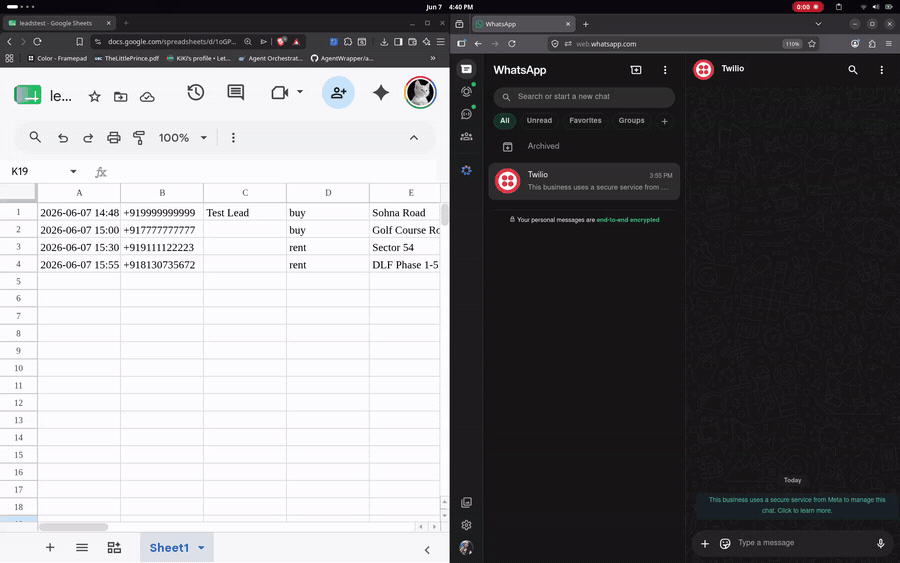
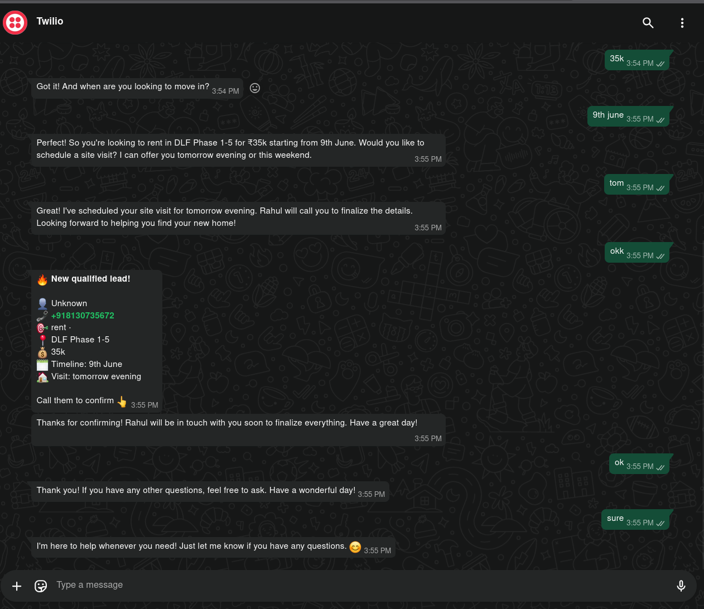
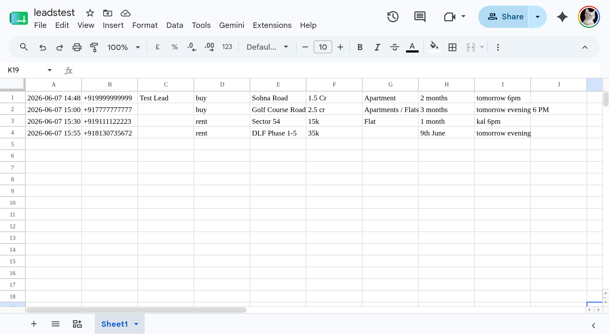

# WhatsApp Real Estate Lead Bot

An AI-powered WhatsApp bot for real estate brokers. A lead messages on WhatsApp,
the bot qualifies them in natural language (English, Hindi, or Hinglish), books a
site visit, logs the lead to a Google Sheet in real time, and alerts the broker.

Built for Gurgaon brokers, but the broker details are configurable for any market.

## Demo



WhatsApp conversation (lead qualification to booking):



Leads logged live to Google Sheets:



## How it works

```
Lead on WhatsApp
   -> Twilio WhatsApp
      -> FastAPI webhook (main.py)
         -> LLM brain qualifies + books (bot.py)
         -> logs lead to Google Sheet, live (store.py)
         -> alerts the broker on WhatsApp (notify.py)
```

The bot collects intent (buy or rent), area, budget, property type, and timeline,
then proposes a site visit. Each lead gets one row in the Google Sheet that updates
as the conversation progresses.

## Project structure

| File | Purpose |
|------|---------|
| `config.py` | Broker settings (areas, budget, agent, questions). Edit this per client. |
| `bot.py` | The LLM brain, system prompt, and qualification logic. |
| `main.py` | FastAPI webhook that Twilio calls on each incoming message. |
| `store.py` | Logs qualified leads to Google Sheets (CSV fallback). |
| `notify.py` | Sends a WhatsApp alert to the broker on a new booked lead. |
| `chat_test.py` | Talk to the bot in your terminal, no WhatsApp needed. |

## Requirements

- Python 3.10+
- A Twilio account (WhatsApp sandbox is free for testing)
- An LLM API key: OpenAI (recommended) or Google Gemini (free tier)
- A Google Cloud service account with the Sheets API enabled

## Setup

### 1. Install

```bash
git clone https://github.com/codebanditssss/whatsapp-bot.git
cd whatsapp-bot
python3 -m venv venv
source venv/bin/activate
pip install -r requirements.txt
```

### 2. Configure environment

```bash
cp .env.example .env
```

Open `.env` and fill in your keys:

```
# Twilio (from console.twilio.com)
TWILIO_ACCOUNT_SID=AC...
TWILIO_AUTH_TOKEN=...
TWILIO_WHATSAPP_FROM=whatsapp:+14155238886

# LLM brain - set OpenAI to use OpenAI, otherwise it uses Gemini
OPENAI_API_KEY=sk-...
OPENAI_MODEL=gpt-4o-mini
GEMINI_API_KEY=...
GEMINI_MODEL=gemini-2.5-flash-lite

# Google Sheets (the CRM)
GOOGLE_SHEET_ID=your_sheet_id_from_the_url
GOOGLE_CREDENTIALS_FILE=credentials.json

# Broker alerts (their WhatsApp number)
BROKER_WHATSAPP=whatsapp:+91XXXXXXXXXX
```

### 3. Google Sheets access

1. Create a Google Cloud project and enable the Google Sheets API and Google Drive API.
2. Create a service account, then create a JSON key for it.
3. Save that JSON file in this folder as `credentials.json`.
4. Create a Google Sheet, copy its ID from the URL, and put it in `GOOGLE_SHEET_ID`.
5. Share the Sheet with the service account email (the `client_email` in the JSON)
   as an Editor.

### 4. Set the broker details

Edit the `BROKER` dictionary in `config.py` with the broker's agency name, agent
name, served areas, property types, and budget range.

## Running

### Test the brain locally (no WhatsApp needed)

```bash
source venv/bin/activate
python chat_test.py
```

Type messages as if you were a lead and confirm the bot qualifies and books a visit.

### Run the live webhook

```bash
uvicorn main:app --host 0.0.0.0 --port 8000
```

Expose it with a tunnel so Twilio can reach it:

```bash
cloudflared tunnel --url http://localhost:8000
```

Copy the public HTTPS URL the tunnel prints.

### Point Twilio at the bot

In the Twilio Console: Messaging -> Try it out -> Send a WhatsApp message ->
Sandbox settings. Set "When a message comes in" to:

```
https://YOUR-TUNNEL-URL/whatsapp
```

Set the method to POST and save. Now message your Twilio sandbox number on WhatsApp
and the bot will reply.

## Configuration notes

- The bot uses OpenAI if `OPENAI_API_KEY` is set, otherwise it falls back to Gemini.
- Sheet logging falls back to a local `leads.csv` if Google Sheets is unreachable,
  so a lead is never lost.
- Conversation state is kept in memory, which is fine for a demo. Use Redis for
  production.

## Security

Never commit `.env` or `credentials.json`. Both are listed in `.gitignore`. If a key
is ever exposed, rotate it immediately.

## Roadmap

- Deploy to a host (Render or Railway) for an always-on URL.
- Register a dedicated WhatsApp sender instead of the sandbox.
- Move conversation state to Redis.
- Add an admin panel for non-technical broker configuration.
